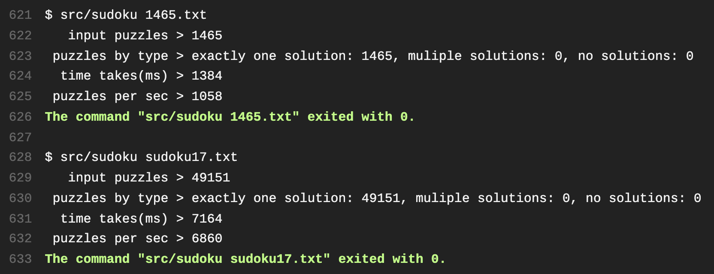

## Overview
[](https://travis-ci.org/singaurav/fast-sudoku-solver)

A fast __Sudoku__ solver written in __C++__ that uses a simple and efficient non-traditional backtracking approach to solve the popular logic puzzle.

Given a puzzle, the solver creates possible arrangements of 9 cells of each digit. The problem then reduces to finding 9 arrangements - one for each digit - such that they don't share any cell among them. For time and memory efficient backtracking linked lists are used.

The solver easily solves thousands of the hardest puzzles (top 1465 and Gordon Royle's sudoku17) per second on Travis build servers.



## Getting started
* #### Requirements

 > Linux

  + [CMake](https://cmake.org/)
  + [Clang](https://clang.llvm.org/)

 > Windows

 + [CMake](https://cmake.org/)
 + [MinGW](http://www.mingw.org/)
* #### Build
> Linux

  ```
  1. git clone https://github.com/singaurav/fast-sudoku-solver.git
  2. mkdir fast-sudoku-solver-build
  3. cd fast-sudoku-solver-build
  4. cmake ../fast-sudoku-solver
  5. make         
  ```    
 > Windows

   ```
   1. git clone https://github.com/singaurav/fast-sudoku-solver.git
   2. mkdir fast-sudoku-solver-build
   3. cd fast-sudoku-solver-build
   4. cmake -G "MinGW Makefiles" ../fast-sudoku-solver
   5. make         
   ```     
* #### Run
> Linux

  ```
  1. cd src
  2. ./sudoku -h (displays usage help)
  ```

 > Windows

   ```
   1. cd src
   2. sudoku.exe -h (displays usage help)
   ```
* #### Test
 > Linux

 ```
 1. cd test
 2. ./sudokuTest -d yes
 ```

 > Windows

 ```
 1. cd test
 2. sudokuTest.exe -d yes
 ```

## More
* Please raise any issues or bugs [here.](https://github.com/singaurav/fast-sudoku-solver/issues)
